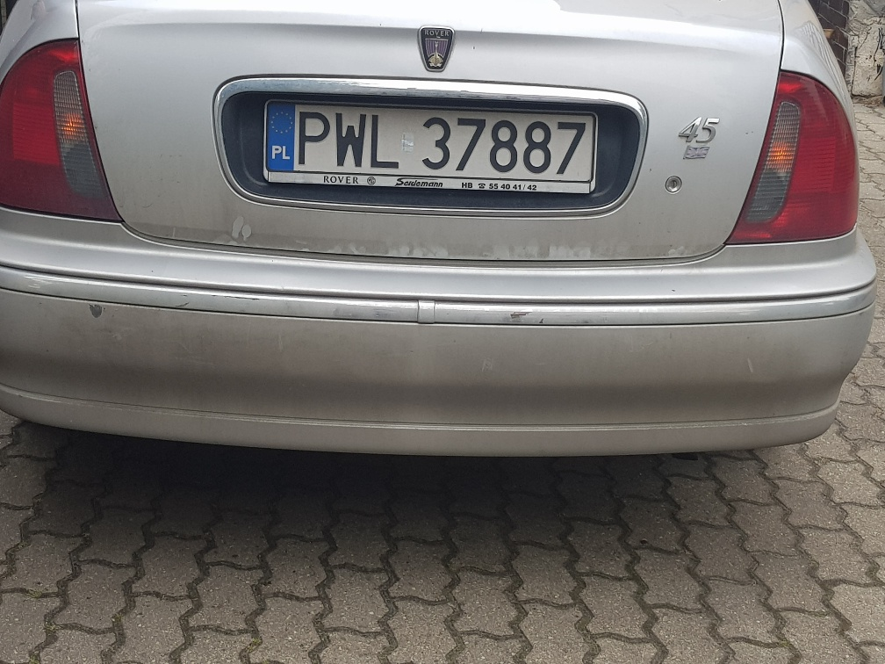

# Car Plates Recognizer
Repository contains description of Computer Vision laboratory project which is based on recognizing car plates using OpenCV with Python 3.7.

## Project tasks
- find and extract possible car plates from image
- recognize signs from extracted plate

## Example use case
- car back image

<br/>

- extracted plate


<br/>

- JSON file with result for given image

```JSON
{
    "car_back.jpg": "PWL3787"
}
```

## Project requirements
- car plates rotated less than 45 degrees in comparison to horizontal position
- width of plate is bigger than 1/3 of image width
- only common polish car plates which contain 7 black signs on white background
- image with different resolution
- no use of OCR and ML trained methods and algorithms

## Detector results on project image set
- Accurancy: 0.845433 (361 good chars per 427 total)                                                                                                                                                         
- Find acc: 0.950000 (57 readed plates for 60 total)                                                                                                                                                         
- OCR acc: 0.904762 (361 readed chars for 399 total)
